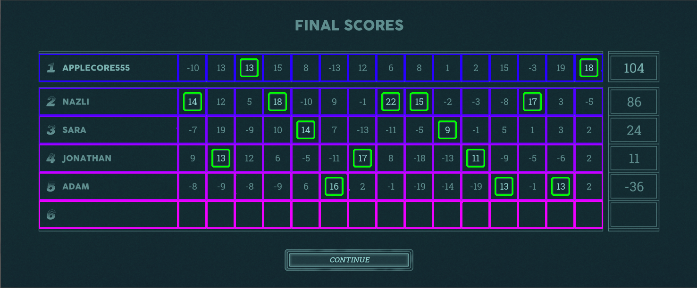

# nertbot
A Discord bot that plots the results of Nerts games.

## How It Works
Nertbot takes a screenshot of the scoreboard from a game of Nerts and generates a plot of scores vs time. The script in the repo needs a bot token, which is generated while creating a bot in the Discord developers portal. When the bot is tagged in the server (@nertbot, in my case), it looks for an image attachment, which should be the screenshot, which it dumps through the CV pipeline.

The pipeline starts by preprocessing the image (converting to grayscale, applying a gaussian blur, thresholding, etc). It then uses a color copy of the image to locate the blue scoreboard, and crops down to that. It makes use of OpenCV's contour detection to identify the score and name cells, and organizes them into a 2D array by location. It is then able to parse each out into a Player object, which holds the location of the player name and each score. An OCR step crops the scoreboard down to each username and score, and then uses Tesseract to parse the text therein. Finally, it uses pyplot to generate a plot of the data, stores the plot as an image, and posts it to the Discord server.

## Setup
Nertbot runs on Python 3. It requires the following packages, all available via pip:
* python-opencv
* numpy
* matplotlib
* pytesseract
* python-dotenv
* discord
* pillow

You'll also need the full tesseract model that includes legacy support, which can be found [here](https://github.com/tesseract-ocr/tessdata). The filename is `eng.traineddata`. You'll have to replace the file tesseract installs with this one- its location varies on different operating systems.

It not running on Windows, you'll have to comment out the folloeing line in `nertbot.py`:

`pytesseract.pytesseract.tesseract_cmd = r'C:\\Program Files\\Tesseract-OCR\\Tesseract.exe'`

You'll also need to configure the Discord bot via their web interface. A guide on that can be found [here](https://realpython.com/how-to-make-a-discord-bot-python/). When you have the bot's token, create a file in the root directory of the repo called `.env` with the following contents:

> `# .env`
> 
> `DISCORD_TOKEN={token}`

## Usage
To process an image without the Discord interface, you can just run `nertbot.py`. It will pull a file from the `samples` directory and generate the plot. It's easy to point it at a different screenshot by changing the file path at the end of the file.

To run the full discord bot, once everything is configured just run `nertbot-discord.py`. It will run continuously, so I recommend running it inside `screen` or similar so you can disconnect from the process.

